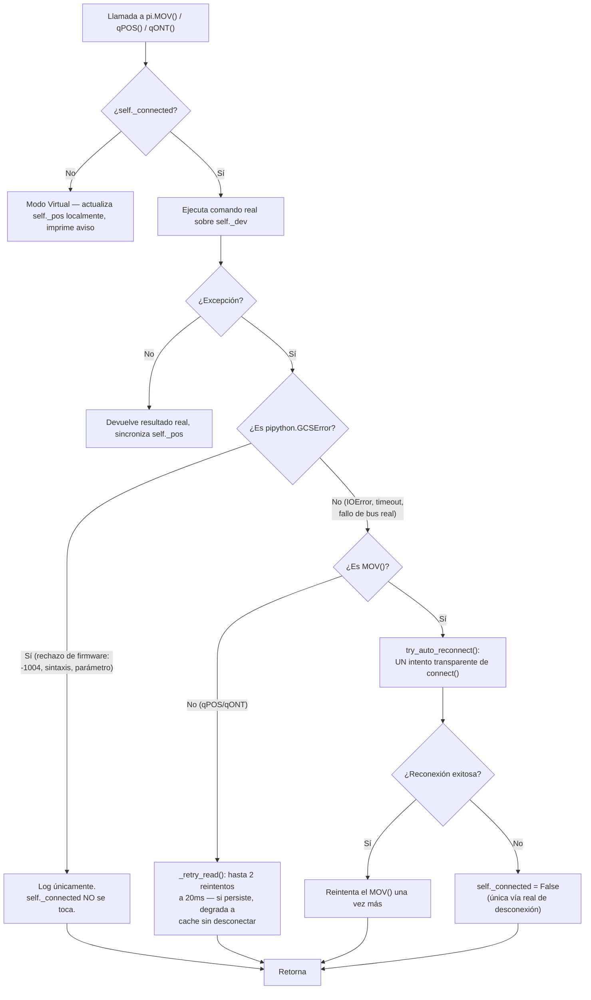
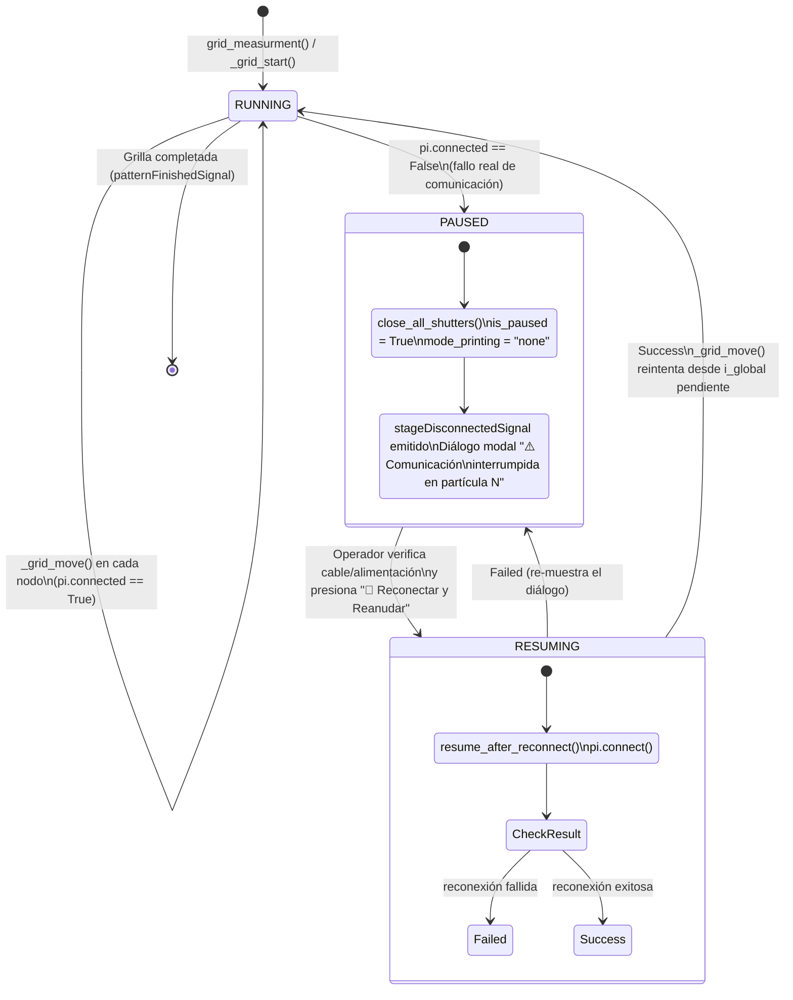

# SYS-205: Resiliencia del Driver de Platina PI E-517 y Tolerancia a Fallas 🔌

**PyPrinting 3.0 / PySpectrum 3.0 — Suite de Nanofotónica y Control Instrumental**
**Laboratorio de Nanofotónica — Instituto de Nanosistemas (INS-UNSAM / CONICET)**
**Autor Principal:** José Luis González Peñafiel (*Becario Doctoral CONICET*)
**Código del Documento:** `SYS-205` | **Eje Temático:** `[HAL] (Capa de Abstracción de Hardware y Tolerancia a Fallas en Platina PI E-517)`
**Fecha de Emisión:** Septiembre 2026 | **Estado:** Aprobado / Producción

---

## 🔗 Matriz de Referencias Cruzadas

- **Reportes de Sistema Conexos:**
  - `[[SYS-101_Arquitectura_Hilos_Concurrencia_QThread]]`
  - `[[SYS-103_Regimenes_Coordenadas_e_Invariancia_Cinematica]]`
  - `[[SYS-201_Seguridad_Optica_Watchdog_y_Obturadores]]`
  - `[[SYS-403_Registro_Bugs_Causa_Raiz_Rutina_Printing]]`
- **Fundamentos Científicos Asociados:**
  - `[[CAT-101_Protocolo_Operativo_Impresion_Fototermica_Grillas_2D]]`
  - `[[CAT-105_Compensacion_Deriva_Termomecanica_Particula_Ancla_P0]]`
- **Manuales de Usuario Conexos:**
  - `[[MOD-02_Measurements_Printing_y_Dimeros]]`
- **Decisiones Arquitectónicas:** `DEC-011` (`docs/decisions/DECISION_LOG.md`)
- **Módulos de Código Fuente:** `config.py`, `modules/measurements.py`, `core/nanopositioning.py`

---

## 1. 📋 Resumen Ejecutivo

Este informe documenta la reingeniería de la capa de abstracción de hardware (`_PIController` en `config.py`) que gobierna la platina piezoeléctrica triaxial Physik Instrumente E-517 ($0.0 - 100.0\ \mu\text{m}$ por eje), motivada por una regresión que provocaba **desconexiones artificiales e irreversibles** hacia "Modo Virtual" en mediciones nocturnas no supervisadas (impresión de grillas 2D, escaneos confocales largos, seguimiento de deriva térmica).

La causa raíz combinaba tres problemas de diseño independientes pero acumulativos:
1. Un manejo de excepciones genérico que no distinguía un **rechazo de comando de firmware** (`GCSError`) de una **pérdida física real de comunicación USB**.
2. Ausencia de un clampeo preventivo de coordenadas, permitiendo que cálculos de grilla con corrección de deriva generaran objetivos fraccionalmente fuera de rango.
3. Saturación innecesaria del bus serie mediante consultas de identidad (`*IDN?`) repetidas durante movimiento activo.

La solución implementada (`DEC-011`) introduce cuatro capas de defensa — clampeo matemático incondicional, aislamiento de excepciones por tipo, reintentos con degradación segura y auto-reconexión transparente — más una máquina de estados de pausa/reanudación a nivel de aplicación que garantiza **cero pérdida de partículas ya impresas** ante una falla de comunicación genuina.

> [!IMPORTANT]
> Ninguna de estas correcciones relaja el interlock de rango físico $[0, 100]\ \mu\text{m}$ (CLAUDE.md §4) — lo refuerza. El clampeo ahora ocurre en el driver mismo, no solo en cada llamador individual.

---

## 2. 🔎 Análisis de Causa Raíz

### 2.1 Comportamiento Histórico (Versión *Legacy*)

En la implementación original de PyPrinting (previa a la introducción de `_PIController` como envoltorio resiliente con soporte de reconexión en caliente), el driver de la platina **nunca desconectaba el software ante un error de comando**. Un rechazo de firmware simplemente propagaba una excepción hacia arriba, o en el peor caso, era ignorado silenciosamente por el llamador — pero el estado de "conectado" del driver permanecía intacto entre llamadas.

### 2.2 Regresión Introducida (commits `8644d40`, `4a22652`)

Al incorporar el modo `SAFE_MODE`/Hot-Plug para permitir arranque sin hardware físico y reconexión en caliente, se envolvió cada llamada real a `pipython.GCSDevice` en un bloque de captura de excepciones genérico:

```python
# Patrón introducido en 8644d40 / 4a22652 (simplificado)
def MOV(self, axes, targets):
    try:
        return self._dev.MOV(axes, targets)
    except Exception as e:
        print(f"[PI] Error... — Platina desconectada")
        self._connected = False  # ⚠️ Desconexión artificial irreversible
```

El problema: `except Exception` captura **indiscriminadamente** tanto una excepción de comunicación de bajo nivel (el cable USB realmente desenchufado) como una excepción de **protocolo de aplicación** — un `GCSError` que el propio firmware de la controladora E-517 devuelve cuando rechaza un comando sintácticamente válido pero semánticamente inválido.

### 2.3 Disparador Dominante: `GCSError -1004` por Límites de Coordenadas

El disparador más frecuente en producción fue el código de error **-1004 ("Position out of limits")**. Un nodo de grilla se calcula como:

$$x_{\text{nodo}} = X_0 + x_{\text{grilla},i} + \text{shift}_x + \Delta x_{\text{deriva}}$$

Si $X_0$ (posición de referencia capturada por `Set reference`), el offset de la grilla, el desplazamiento de autofoco (`shiftx`/`shifty`) y la corrección de deriva acumulada suman una coordenada que excede $[0.0, 100.0]\ \mu\text{m}$ por una fracción de micrón, la controladora rechaza el comando `MOV` con `-1004`. El código pre-existente interpretaba esto como "la platina se desconectó", apagaba `self._connected`, y **todos los comandos posteriores** (incluidos los de nodos perfectamente válidos) caían en la rama de Modo Virtual — silenciosa e irreversiblemente, sin que la platina física se hubiera movido en absoluto desde ese instante.

### 2.4 Disparador Secundario: Colisión de Bus Durante Polling Activo

`core/nanopositioning.py` y varias rutinas de escaneo (`modules/confocal.py`, `pyspectrum/modules/routines/linescan_spectroscopy.py`) sondean el estado de asentamiento del actuador en un bucle ajustado:

```python
while not all(pi.qONT(axes).values()):
    time.sleep(0.01)
```

Una colisión transitoria en el bus serie (un `qPOS()` disparado desde la GUI en el mismo instante en que el bucle anterior espera `qONT()`, o un micro-retardo de $\sim 1\ \text{ms}$ en el buffer) producía una excepción efímera y sin importancia real — pero el mismo `except Exception: self._connected = False` la trataba con la misma severidad que un desenchufe físico.

### 2.5 Saturación de Bus por `is_physically_connected()`

El chequeo de salud periódico invocado desde el dock de Nanoposicionamiento llamaba `self._dev.qIDN()` — una consulta de texto completa por el bus USB — en **cada refresco de posición**, típicamente varias veces por segundo. Durante un movimiento activo, esto competía por ancho de banda del bus serie con los propios comandos `MOV`/`qPOS`, incrementando la probabilidad del disparador de la Sección 2.4.

---

## 3. 🏗️ Arquitectura de Resiliencia en `config.py`

### 3.1 Diagrama de Aislamiento de Excepciones



### 3.2 Clampeo Matemático Incondicional

`_PIController.MOV()` (y `_MockPI.MOV()`, para paridad de comportamiento bajo pruebas automatizadas — `pipython` no está instalado en el entorno de desarrollo/CI, por lo que `pi` siempre resuelve a `_MockPI`) clampea **toda** coordenada antes de que llegue al dispositivo:

$$x_{\text{enviado}} = \max\big(0.0,\ \min(\text{PI\_STAGE\_RANGE\_UM},\ x_{\text{solicitado}})\big)$$

```python
clamped_any = False
for i, tg in enumerate(targets_list):
    clamped = max(0.0, min(PI_STAGE_RANGE_UM, float(tg)))
    if clamped != float(tg):
        clamped_any = True
    targets_list[i] = clamped
if clamped_any:
    print(f"[PI Driver Clamped] MOV solicitado fuera de rango, acotado a [0, {PI_STAGE_RANGE_UM}] µm: ...")
```

Este único punto de defensa erradica `GCSError -1004` en la fuente, **independientemente de si el código llamador individual recordó clampear** — corrigiendo por diseño la asimetría observada previamente, donde `pyspectrum/modules/routines/linescan_spectroscopy.py` sí clampeaba en el llamador pero `modules/confocal.py`/`modules/measurements.py` no.

### 3.3 Aislamiento de `pipython.GCSError`

```python
try:
    from pipython import GCSError
except ImportError:
    class GCSError(Exception):
        """Stand-in cuando pipython no está instalado (entorno mock/test)."""
        pass
```

`MOV()`, `qPOS()` y `qONT()` capturan `GCSError` en una rama dedicada que **nunca** modifica `self._connected` — un rechazo de firmware es, por definición, evidencia de que la controladora está viva y respondiendo (si no lo estuviera, no habría firmware disponible para *rechazar* nada).

### 3.4 Reintentos con Degradación Segura (`_retry_read`)

```python
def _retry_read(self, fn, max_retries: int = 2, delay_s: float = 0.02):
    last_exc = None
    for attempt in range(max_retries + 1):
        try:
            return fn()
        except Exception as e:
            last_exc = e
            if attempt < max_retries:
                time.sleep(delay_s)
    raise last_exc
```

`qPOS()` y `qONT()` envuelven su llamada real en `_retry_read()`. Si los 3 intentos (1 original + 2 reintentos, $\Delta t = 20\ \text{ms}$ cada uno) fallan, **ninguno de los dos métodos desconecta**:
- `qPOS()` devuelve la última posición conocida en memoria (`self._pos`).
- `qONT()` asume que el eje llegó a destino (`{axis: True}`).

Esta decisión de diseño refleja que un fallo de *lectura* durante movimiento activo (Sección 2.4) no es, por sí solo, evidencia de desconexión — solo un fallo de *escritura* (`MOV`) que sobrevive un intento de reconexión automática lo es (Sección 3.6).

### 3.5 Eliminación del Spam de `*IDN?`

```python
def is_physically_connected(self) -> bool:
    with self._lock:
        if not self._connected or self._isolated or self._dev is None:
            return False
        try:
            if hasattr(self._dev, "IsConnected"):
                return bool(self._dev.IsConnected())
            return self._connected  # fallback si esta versión de pipython no lo expone
        except Exception:
            self._connected = False
            return False
```

`GCSDevice.IsConnected()` es una consulta de estado del lado del host (verifica si el socket/handle USB sigue abierto) sin generar tráfico hacia el controlador — a diferencia de `qIDN()`, que exige una respuesta activa del firmware por el bus serie.

### 3.6 Auto-Reconexión Transparente

```python
def try_auto_reconnect(self) -> bool:
    print("[PI] Intentando reconexión automática transparente...")
    try:
        return self.connect(PI_SERIAL)
    except Exception as e:
        print(f"[PI] Reconexión automática fallida: {e}")
        return False
```

`MOV()` invoca `try_auto_reconnect()` únicamente en su rama de excepción **no-`GCSError`** (comunicación de bajo nivel genuina). Si la reconexión tiene éxito, se reintenta el comando `MOV` original una única vez antes de continuar. Solo si la reconexión automática también falla se apaga `self._connected` — el disparador más angosto posible, alineado con el comportamiento *legacy* de nunca desconectar ante un simple error de comando.

---

## 4. ✈️ Validación Pre-Flight en `modules/measurements.py`

El clampeo de la Sección 3.2 protege el **hardware**, pero no protege la **validez geométrica del experimento**: una coordenada de borde silenciosamente clampeada imprimiría una nanopartícula en una posición distinta a la calculada, distorsionando la grilla sin que el operador lo note hasta procesar los datos horas después.

`Backend._preflight_grid_range_check()`, invocado al inicio de `_grid_start()` — **antes** de mover la platina o abrir cualquier obturador — calcula la envolvente geométrica total del experimento:

$$
\begin{aligned}
x_{\min} &= X_0 + \min(x_{\text{grilla}}) - \delta_{\text{margen}} \\
x_{\max} &= X_0 + \max(x_{\text{grilla}}) + \delta_{\text{margen}} \\
y_{\min} &= Y_0 + \min(y_{\text{grilla}}) - \delta_{\text{margen}} \\
y_{\max} &= Y_0 + \max(y_{\text{grilla}}) + \delta_{\text{margen}}
\end{aligned}
\qquad \delta_{\text{margen}} = 3.0\ \mu\text{m}
$$

con $\delta_{\text{margen}} = 3.0\ \mu\text{m}$ como colchón de seguridad ante deriva térmica acumulada durante un lote largo. Si cualquiera de los cuatro límites excede $[0.0, \text{PI\_STAGE\_RANGE\_UM}]$, la rutina **aborta antes de disparar el láser**, restaura `mode_printing = "none"` y emite `gridRangeErrorSignal(str)`, que el frontend muestra como un `QMessageBox.warning` no ambiguo indicando el rango calculado y sugiriendo ajustar `startX`/`startY` o el tamaño de la grilla.

> [!NOTE]
> El margen de deriva actúa como salvaguarda incluso para una grilla nominalmente dentro de rango: un nodo en $x=99.5\ \mu\text{m}$ es matemáticamente válido, pero se bloquea porque $99.5 + 3.0 > 100.0$ — reflejando que la platina física podría derivar térmicamente fuera de rango antes de que ese nodo se alcance.

---

## 5. 🔄 Máquina de Estados Pausa/Reanudación

Para el caso residual — una desconexión física **real** que sobrevive el clampeo, el aislamiento de `GCSError` y el auto-reintento — se implementó una máquina de estados a nivel de aplicación que protege la muestra y preserva el progreso del experimento en curso:



### 5.1 Invariante de Preservación de Datos

La transición `RUNNING → PAUSED` **deliberadamente no toca**:
- `self.i_global` (índice de la partícula pendiente).
- `self.node_results` (estados de éxito/timeout de partículas ya procesadas).
- `self.drift_history_xy` / `self.drift_history_z` (logs de telemetría de deriva).

Esto garantiza que `resume_after_reconnect() → _grid_move()` retome exactamente en el nodo donde se interrumpió, sin reiniciar la grilla ni perder ninguna nanopartícula ya impresa exitosamente — el requisito central de la misión para mediciones nocturnas no supervisadas.

### 5.2 Punto de Verificación Único

`_check_physical_connection_or_pause()` se invoca al inicio de `_grid_move()`, el único punto de la máquina de estados por el que pasa **cada** transición de nodo, independientemente de la etapa del Protocolo de Doble Autofoco (Etapas 1/4 a 4/4, ver `[[MOD-02_Measurements_Printing_y_Dimeros]]` Sección 6) en la que se encuentre el experimento. Esto evita tener que instrumentar por separado cada una de las llamadas `pi.MOV()` dispersas a lo largo del flujo de 4 etapas.

---

## 6. 🧪 Batería de Pruebas y Validación Formal

`tests/test_pi_stage_resilience.py` (18 pruebas) ejercita `_PIController` directamente mediante un doble de prueba (`_FakeGCSDevice`) inyectado post-construcción — dado que `pipython` no está instalado en este entorno, `self._dev` sería `None` de otro modo, imposibilitando alcanzar las ramas de código bajo prueba:

| Grupo de Pruebas | Casos Verificados | Resultado |
| :--- | :--- | :--- |
| Clampeo (`_MockPI`) | `MOV(1, -10.0)` → `0.0`; `MOV(1, 150.0)` → `100.0`; conexión intacta en ambos casos | ✅ 3/3 |
| Aislamiento `GCSError` | `MOV`/`qPOS`/`qONT` con `GCSError` inyectado — `self._connected` permanece `True` | ✅ 3/3 |
| Reintentos y degradación | `qPOS`/`qONT` con fallo transitorio (recupera al 3er intento) y fallo persistente (degrada a caché sin desconectar) | ✅ 4/4 |
| Comunicación real | `MOV` con `IOError` persistente + reconexión fallida → desconecta; `MOV` con fallo único + reconexión exitosa → permanece conectada | ✅ 2/2 |
| `is_physically_connected()` | No invoca `qIDN()` cuando `IsConnected()` está disponible | ✅ 1/1 |
| Pre-flight de grilla | Grilla fuera de rango bloqueada antes de mover platina; grilla válida procede; margen de deriva dispara el bloqueo en un caso límite | ✅ 3/3 |
| Pausa/Reanudación | Desconexión pausa preservando `i_global`; reanudación exitosa retoma en el nodo pendiente | ✅ 2/2 |

**Validación adicional**: `conda run -n printing3 python tests/test_nanopositioning_regimes.py` — 6/6 `OK` (entorno conda dedicado, Python 3.12, distinto del entorno base usado en el resto de la suite). Suite completa `pytest tests/`: 204 pruebas superadas, sin regresiones atribuibles a este cambio.

---

## 7. 📌 Conclusión y Recomendaciones Operativas

La resiliencia del driver PI E-517 se logró no relajando ninguna validación de seguridad, sino **precisando su alcance**: el clampeo de rango sigue siendo obligatorio e incondicional, pero ahora ocurre en el lugar correcto (antes de que el firmware tenga oportunidad de rechazar el comando) y con la severidad correcta (un rechazo de comando ya no se confunde con una desconexión física).

Se recomienda a los operadores:
1. Verificar la geometría de la grilla contra el diálogo de advertencia pre-vuelo antes de asumir que un rechazo indica un bug — en la mayoría de los casos, ajustar `startX`/`startY` unos pocos micrones resuelve el bloqueo.
2. Ante el diálogo de recuperación por desconexión real, verificar físicamente el cable USB y la alimentación de la controladora E-517 **antes** de presionar "🔌 Reconectar y Reanudar" — el experimento retomará exactamente donde se detuvo, sin necesidad de reiniciar la grilla ni perder partículas ya impresas.
3. Para mediciones nocturnas de larga duración, no es necesario ningún cambio de configuración adicional: las cuatro capas de defensa de la Sección 3 y la máquina de estados de la Sección 5 operan de forma transparente y automática.
