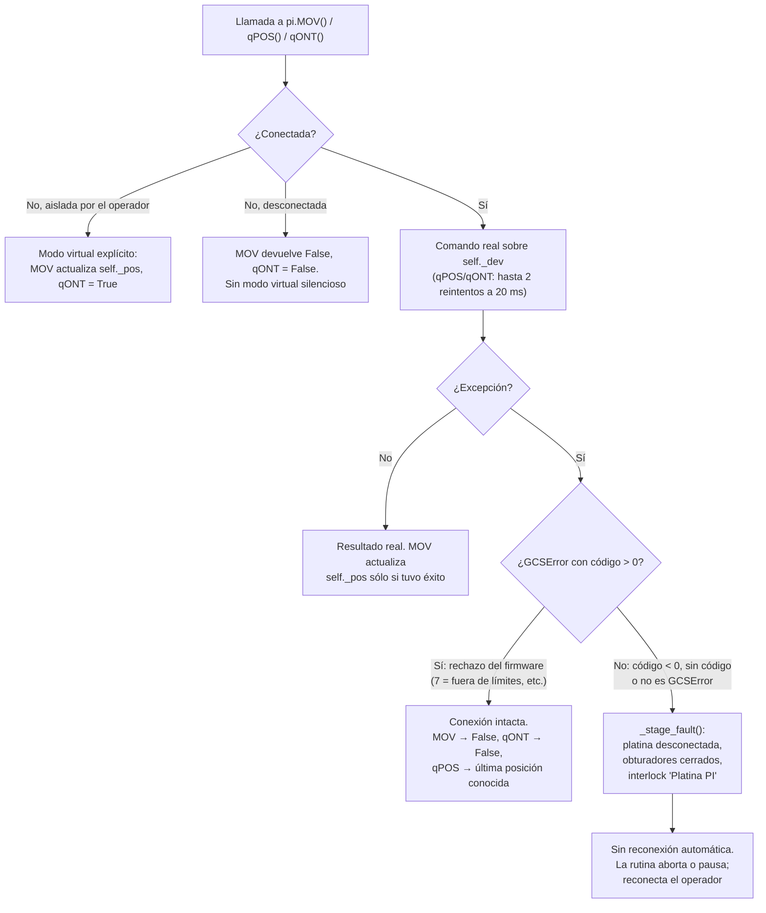
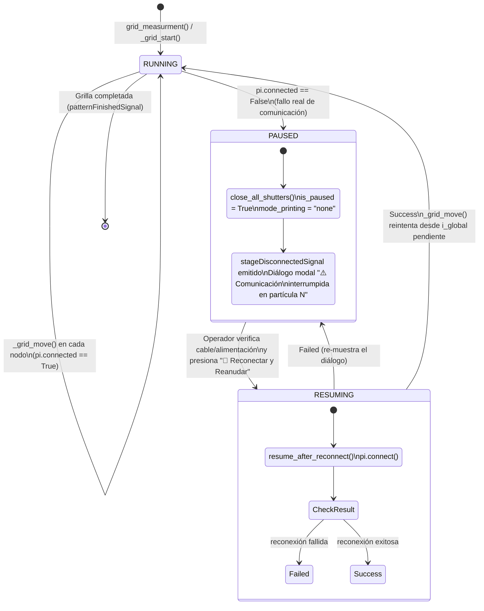

# SYS-205: Resiliencia del Driver de Platina PI E-517 y Tolerancia a Fallas 🔌

**PyPrinting 3.0 / PySpectrum 3.0 — Suite de Nanofotónica y Control Instrumental**
**Laboratorio de Nanofotónica — Instituto de Nanosistemas (INS-UNSAM / CONICET)**
**Autor Principal:** José Luis González Peñafiel (*Becario Doctoral CONICET*)
**Código del Documento:** `SYS-205` | **Eje Temático:** `[HAL] (Capa de Abstracción de Hardware y Tolerancia a Fallas en Platina PI E-517)`
**Fecha de Emisión:** Septiembre 2026 | **Estado:** Aprobado · Revisado por `DEC-036` (2026-09-27) · Los cambios de `DEC-036` están pendientes de verificar en el banco (`BANCO-17`, `BANCO-19`)

> [!WARNING]
> **Revisión 2026-09-27 (`DEC-036`).** Tres piezas de la versión original de este informe (`DEC-011`) ya **no** describen el código y se reemplazaron abajo:
> 1. **No hay reconexión automática.** `try_auto_reconnect()` se eliminó: reconectar llama a `connect()`, que manda la platina a home, y eso ocurría a mitad de la rutina y con el láser abierto. Ante una falla de comunicación la platina se declara desconectada, se cierran todos los obturadores y se bloquea toda apertura (interlock `"Platina PI"`) hasta que el operador reconecte.
> 2. **`qONT()` nunca asume que la platina llegó.** Antes devolvía `True` ante una lectura fallida, y toda espera terminaba como si la platina hubiera llegado. Ahora informa `False`, y las esperas usan `config.wait_on_target()`, acotada en tiempo.
> 3. **Z tiene 20 µm de recorrido, no 100 µm** (platina P-517.3CD, 100 × 100 × 20 µm). El recorte es por eje (`config.PI_AXIS_RANGE_UM`).
>
> Además, el código `-1004` es `PI_UNEXPECTED_RESPONSE` ("Controller sent unexpected response"), **no** "Position out of limits", que es el código `7` (verificado con `pipython` 2.13.0.2). Las secciones 2.3 y 3 se corrigieron en consecuencia.

---

## 🔗 Matriz de Referencias Cruzadas

- **Reportes de Sistema Conexos:**
  - `[[SYS-101_Arquitectura_Hilos_Concurrencia_QThread]]`
  - `[[SYS-103_Regimenes_Coordenadas_e_Invariancia_Cinematica]]`
  - `[[SYS-201_Seguridad_Optica_Watchdog_y_Obturadores]]`
  - `[[SYS-403_Registro_Bugs_Causa_Raiz_Rutina_Printing]]`
- **Fundamentos Científicos Asociados:**
  - `[[CAT-101_Protocolo_Operativo_Impresion_Fototermica_Grillas_2D]]`
  - `[[CAT-105_Compensacion_Deriva_Termomecanica_Particula_Ancla_P0]]`
- **Manuales de Usuario Conexos:**
  - `[[MOD-02_Measurements_Printing_y_Dimeros]]`
- **Decisiones Arquitectónicas:** `DEC-011`, revisada por `DEC-036` (`docs/decisions/DECISION_LOG.md`)
- **Módulos de Código Fuente:** `config.py`, `core/nidaq.py` (interlocks), `modules/measurements.py`, `core/nanopositioning.py`, `modules/confocal.py`, `contrapropagante.py`, `modules/focus.py`
- **Pruebas de banco pendientes:** `BANCO-17` y `BANCO-19` (`docs/evidence/PRUEBAS_BANCO_PENDIENTES.md`)

---

## 1. 📋 Resumen Ejecutivo

Este informe documenta la reingeniería de la capa de abstracción de hardware (`_PIController` en `config.py`) que gobierna la platina piezoeléctrica triaxial Physik Instrumente P-517.3CD con controlador E-517 ($0$–$100\ \mu\text{m}$ en X e Y, $0$–$20\ \mu\text{m}$ en Z), motivada por una regresión que provocaba **desconexiones artificiales e irreversibles** hacia "Modo Virtual" en mediciones nocturnas no supervisadas (impresión de grillas 2D, escaneos confocales largos, seguimiento de deriva térmica).

La causa raíz combinaba tres problemas de diseño independientes pero acumulativos:
1. Un manejo de excepciones genérico que no distinguía un **rechazo de comando de firmware** (`GCSError`) de una **pérdida física real de comunicación USB**.
2. Ausencia de un clampeo preventivo de coordenadas, permitiendo que cálculos de grilla con corrección de deriva generaran objetivos fraccionalmente fuera de rango.
3. Saturación innecesaria del bus serie mediante consultas de identidad (`*IDN?`) repetidas durante movimiento activo.

La solución original (`DEC-011`) introdujo cuatro capas de defensa — clampeo matemático incondicional, aislamiento de excepciones por tipo, reintentos ante lecturas fallidas y auto-reconexión transparente — más una máquina de estados de pausa/reanudación a nivel de aplicación que preserva las partículas ya impresas ante una falla de comunicación genuina. `DEC-036` reemplazó la auto-reconexión por un **interlock** (una falla de comunicación cierra los obturadores y bloquea toda apertura hasta que el operador reconecte) y agregó la confirmación obligatoria de llegada (`wait_on_target`).

> [!IMPORTANT]
> Ninguna de estas correcciones relaja el límite de recorrido físico (CLAUDE.md §4) — lo refuerza. El recorte ocurre en el driver mismo, eje por eje, y no sólo en cada llamador individual.

---

## 2. 🔎 Análisis de Causa Raíz

### 2.1 Comportamiento Histórico (Versión *Legacy*)

En la implementación original de PyPrinting (previa a la introducción de `_PIController` como envoltorio resiliente con soporte de reconexión en caliente), el driver de la platina **nunca desconectaba el software ante un error de comando**. Un rechazo de firmware simplemente propagaba una excepción hacia arriba, o en el peor caso, era ignorado silenciosamente por el llamador — pero el estado de "conectado" del driver permanecía intacto entre llamadas.

### 2.2 Regresión Introducida (commits `8644d40`, `4a22652`)

Al incorporar el modo `SAFE_MODE`/Hot-Plug para permitir arranque sin hardware físico y reconexión en caliente, se envolvió cada llamada real a `pipython.GCSDevice` en un bloque de captura de excepciones genérico:

```python
# Patrón introducido en 8644d40 / 4a22652 (simplificado)
def MOV(self, axes, targets):
    try:
        return self._dev.MOV(axes, targets)
    except Exception as e:
        print(f"[PI] Error... — Platina desconectada")
        self._connected = False  # ⚠️ Desconexión artificial irreversible
```

El problema: `except Exception` captura **indiscriminadamente** tanto una excepción de comunicación de bajo nivel (el cable USB realmente desenchufado) como una excepción de **protocolo de aplicación** — un `GCSError` que el propio firmware de la controladora E-517 devuelve cuando rechaza un comando sintácticamente válido pero semánticamente inválido.

### 2.3 Disparador Dominante: `GCSError 7` por Límites de Coordenadas

> [!NOTE]
> **Corrección 2026-09-27.** La versión original atribuía este rechazo al código **-1004**. En `pipython`, `-1004` es `PI_UNEXPECTED_RESPONSE` ("Controller sent unexpected response"), un error de la **interfaz**; el rechazo por límites es el código de firmware **7** ("Position out of limits"). La distinción importa porque `DEC-036` clasifica por el signo del código: negativo = comunicación, positivo = firmware.

El disparador más frecuente que se documentó fue el código de error **7 ("Position out of limits")**. Un nodo de grilla se calcula como:

$$x_{\text{nodo}} = X_0 + x_{\text{grilla},i} + \text{shift}_x + \Delta x_{\text{deriva}}$$

Si $X_0$ (posición de referencia capturada por `Set reference`), el offset de la grilla, el desplazamiento de autofoco (`shiftx`/`shifty`) y la corrección de deriva acumulada suman una coordenada que excede el recorrido del eje por una fracción de micrón, la controladora rechaza el comando `MOV` con el código 7. El código pre-existente interpretaba esto como "la platina se desconectó", apagaba `self._connected`, y **todos los comandos posteriores** (incluidos los de nodos perfectamente válidos) caían en la rama de Modo Virtual — silenciosa e irreversiblemente, sin que la platina física se hubiera movido en absoluto desde ese instante.

### 2.4 Disparador Secundario: Colisión de Bus Durante Polling Activo

`core/nanopositioning.py` y varias rutinas de escaneo (`modules/confocal.py`, `pyspectrum/modules/routines/linescan_spectroscopy.py`) sondean el estado de asentamiento del actuador en un bucle ajustado:

```python
while not all(pi.qONT(axes).values()):
    time.sleep(0.01)
```

Una colisión transitoria en el bus serie (un `qPOS()` disparado desde la GUI en el mismo instante en que el bucle anterior espera `qONT()`, o un micro-retardo de $\sim 1\ \text{ms}$ en el buffer) producía una excepción efímera y sin importancia real — pero el mismo `except Exception: self._connected = False` la trataba con la misma severidad que un desenchufe físico.

### 2.5 Saturación de Bus por `is_physically_connected()`

El chequeo de salud periódico invocado desde el dock de Nanoposicionamiento llamaba `self._dev.qIDN()` — una consulta de texto completa por el bus USB — en **cada refresco de posición**, típicamente varias veces por segundo. Durante un movimiento activo, esto competía por ancho de banda del bus serie con los propios comandos `MOV`/`qPOS`, incrementando la probabilidad del disparador de la Sección 2.4.

---

## 3. 🏗️ Arquitectura de Resiliencia en `config.py`

### 3.1 Diagrama de Aislamiento de Excepciones (vigente desde `DEC-036`)


```mermaid
flowchart TD
    A["Llamada a pi.MOV() / qPOS() / qONT()"] --> B{"¿Conectada?"}
    B -- "No, aislada por el operador" --> Z["Modo virtual explícito:\nMOV actualiza self._pos, qONT = True"]
    B -- "No, desconectada" --> Y["MOV devuelve False, qONT = False.\nSin modo virtual silencioso"]
    B -- Sí --> C["Comando real sobre self._dev\n(qPOS/qONT: hasta 2 reintentos a 20 ms)"]
    C --> D{"¿Excepción?"}
    D -- No --> E["Resultado real. MOV actualiza\nself._pos sólo si tuvo éxito"]
    D -- Sí --> F{"¿GCSError con código > 0?"}
    F -- "Sí: rechazo del firmware\n(7 = fuera de límites, etc.)" --> G["Conexión intacta.\nMOV → False, qONT → False,\nqPOS → última posición conocida"]
    F -- "No: código < 0, sin código\no no es GCSError" --> H["_stage_fault():\nplatina desconectada,\nobturadores cerrados,\ninterlock 'Platina PI'"]
    H --> I["Sin reconexión automática.\nLa rutina aborta o pausa;\nreconecta el operador"]
```

### 3.2 Clampeo Matemático Incondicional

`_PIController.MOV()` (y `_MockPI.MOV()`, para paridad de comportamiento bajo pruebas automatizadas: con `SAFE_MODE` activo, `pi` resuelve a `_MockPI`) recorta **toda** coordenada al recorrido de su eje antes de que llegue al dispositivo:

$$x_{\text{enviado}} = \max\big(0,\ \min(R_{\text{eje}},\ x_{\text{solicitado}})\big), \qquad R_X = R_Y = 100\ \mu\text{m},\quad R_Z = 20\ \mu\text{m}$$

```python
# config.py — PI_AXIS_RANGE_UM = {1: 100.0, 2: 100.0, 3: PI_Z_RANGE_UM (20.0)}
for i, (ax, tg) in enumerate(zip(axes_list, targets_list)):
    clamped = clamp_axis_um(ax, tg)
    if clamped != float(tg):
        clamped_any = True
    targets_list[i] = clamped
```

> [!NOTE]
> Hasta `DEC-036` los tres ejes se recortaban a 100 µm, y un Z entre 20 y 100 µm llegaba al controlador, que lo rechazaba con el código 7. El recorrido de 20 µm en Z sale de la hoja de datos de la P-517.3CD y está pendiente de confirmar en el banco con `tools/bench/pi_stage_probe.py` (`qTMN`/`qTMX`, `BANCO-17`).

Este único punto de defensa erradica el `GCSError 7` en la fuente, **independientemente de si el código llamador individual recordó clampear** — corrigiendo por diseño la asimetría observada previamente, donde `pyspectrum/modules/routines/linescan_spectroscopy.py` sí clampeaba en el llamador pero `modules/confocal.py`/`modules/measurements.py` no.

### 3.3 Aislamiento de `pipython.GCSError`

```python
try:
    from pipython import GCSError
except ImportError:
    class GCSError(Exception):
        """Stand-in cuando pipython no está instalado (entorno mock/test)."""
        pass
```

Un rechazo del firmware (`GCSError` con código **positivo**) **nunca** modifica `self._connected`: es evidencia de que la controladora está viva y respondiendo (si no lo estuviera, no habría firmware disponible para *rechazar* nada).

> [!IMPORTANT]
> **Precisión de `DEC-036`.** `pipython` usa `GCSError` también para las fallas de la **interfaz**, con códigos negativos (`-1` error de comunicación, `-7` timeout, `-1004` respuesta inesperada). La versión original trataba *todo* `GCSError` como rechazo de firmware, así que un timeout del bus pasaba por una falla benigna. `config._is_stage_comm_error()` clasifica ahora por el código: positivo → firmware; negativo, ausente o no numérico → comunicación (lado seguro).

### 3.4 Reintentos con Degradación Segura (`_retry_read`)

```python
def _retry_read(self, fn, max_retries: int = 2, delay_s: float = 0.02):
    last_exc = None
    for attempt in range(max_retries + 1):
        try:
            return fn()
        except Exception as e:
            last_exc = e
            if attempt < max_retries:
                time.sleep(delay_s)
    raise last_exc
```

`qPOS()` y `qONT()` envuelven su llamada real en `_retry_read()`: un fallo transitorio (Sección 2.4) se absorbe con hasta 2 reintentos a $\Delta t = 20\ \text{ms}$. Si los 3 intentos fallan:
- con un rechazo de firmware, la conexión se mantiene; `qPOS()` devuelve la última posición conocida y `qONT()` informa **`False`**;
- con una falla de comunicación, se declara la falla de la platina (`_stage_fault()`, Sección 3.6); `qPOS()` devuelve la última posición conocida y `qONT()` informa **`False`**.

> [!WARNING]
> **Cambio de `DEC-036`.** La versión original hacía que `qONT()` *asumiera* que el eje había llegado (`{axis: True}`) ante una lectura fallida. Como todas las esperas eran `while not all(pi.qONT(...))`, cualquier falla de lectura terminaba la espera como si la platina hubiera llegado, y la rutina seguía, láser incluido. Ahora nunca se inventa un on-target, y las esperas pasan por `config.wait_on_target(axes, timeout_s=5.0, poll_s, on_tick)`: devuelve `True` sólo con la confirmación del lazo cerrado y `False` ante timeout, lectura fallida o platina desconectada. `on_tick` permite renovar `heartbeat_shutter()` en cada vuelta de la espera.

### 3.5 Eliminación del Spam de `*IDN?`

```python
def is_physically_connected(self) -> bool:
    with self._lock:
        if not self._connected or self._isolated or self._dev is None:
            return False
        try:
            if hasattr(self._dev, "IsConnected"):
                return bool(self._dev.IsConnected())
            return self._connected  # fallback si esta versión de pipython no lo expone
        except Exception as e:
            self._stage_fault(f"IsConnected() falló ({e})")   # DEC-036
            return False
```

`GCSDevice.IsConnected()` es una consulta de estado del lado del host (verifica si el socket/handle USB sigue abierto) sin generar tráfico hacia el controlador — a diferencia de `qIDN()`, que exige una respuesta activa del firmware por el bus serie. Por la misma razón, desde `DEC-036` `qIDN()` devuelve la identificación leída **una sola vez** al conectar y no vuelve a consultar el bus.

### 3.6 Falla de Comunicación: Interlock, sin Reconexión Automática (`DEC-036`)

> [!WARNING]
> **Reemplaza a la "auto-reconexión transparente" de `DEC-011`.** `try_auto_reconnect()` llamaba a `connect()`, y `connect()` manda la platina a home (`MOV(PI_HOME_POS)`): una reconexión a mitad de una rutina desplazaba la platina decenas de µm con el láser posiblemente abierto. El operador indicó que en el legado la platina nunca se desconectó: si ocurre, es un evento a investigar, no algo que se deba ocultar.

Ante una falla de comunicación en `MOV()`, `qPOS()`, `qONT()` o `is_physically_connected()`, `_stage_fault(reason)`:
1. declara la platina desconectada (`self._connected = False`);
2. cierra todos los obturadores y activa el interlock `"Platina PI"` (`core.nidaq.trip_shutter_interlock`), que bloquea **toda** apertura;
3. **no** reconecta.

Quien espera la llegada (`wait_on_target`) recibe `False` y actúa: los escaneos confocales (`modules/confocal.py`, `contrapropagante.py`) se abortan con los obturadores cerrados, sin volver a la posición inicial; la impresión de grillas (`modules/measurements.py`) se pausa (Sección 5); `core/nanopositioning.py` y `modules/focus.py` cierran los obturadores. Sólo el operador, desde el Dashboard o con "🔌 Reconectar y Reanudar", llama a `connect()`, que **cierra los obturadores antes del home** y es la única acción que libera el interlock. `disconnect()` también cierra los obturadores antes de su `MOV [0, 0, 0]`.

Una platina que **nunca** estuvo conectada (sesión sin platina) no es una falla: `MOV()` devuelve `False` sin interlock y sin modo virtual silencioso. El modo virtual queda reservado al aislamiento explícito del operador (`set_isolated(True)`).

---

## 4. ✈️ Validación Pre-Flight en `modules/measurements.py`

El clampeo de la Sección 3.2 protege el **hardware**, pero no protege la **validez geométrica del experimento**: una coordenada de borde silenciosamente clampeada imprimiría una nanopartícula en una posición distinta a la calculada, distorsionando la grilla sin que el operador lo note hasta procesar los datos horas después.

`Backend._preflight_grid_range_check()`, invocado al inicio de `_grid_start()` — **antes** de mover la platina o abrir cualquier obturador — calcula la envolvente geométrica total del experimento:

$$
\begin{aligned}
x_{\min} &= X_0 + \min(x_{\text{grilla}}) - \delta_{\text{margen}} \\
x_{\max} &= X_0 + \max(x_{\text{grilla}}) + \delta_{\text{margen}} \\
y_{\min} &= Y_0 + \min(y_{\text{grilla}}) - \delta_{\text{margen}} \\
y_{\max} &= Y_0 + \max(y_{\text{grilla}}) + \delta_{\text{margen}}
\end{aligned}
\qquad \delta_{\text{margen}} = 3.0\ \mu\text{m}
$$

con $\delta_{\text{margen}} = 3.0\ \mu\text{m}$ como colchón de seguridad ante deriva térmica acumulada durante un lote largo. Si cualquiera de los cuatro límites excede $[0.0, \text{PI\_STAGE\_RANGE\_UM}]$, la rutina **aborta antes de disparar el láser**, restaura `mode_printing = "none"` y emite `gridRangeErrorSignal(str)`, que el frontend muestra como un `QMessageBox.warning` no ambiguo indicando el rango calculado y sugiriendo ajustar `startX`/`startY` o el tamaño de la grilla.

> [!NOTE]
> El margen de deriva actúa como salvaguarda incluso para una grilla nominalmente dentro de rango: un nodo en $x=99.5\ \mu\text{m}$ es matemáticamente válido, pero se bloquea porque $99.5 + 3.0 > 100.0$ — reflejando que la platina física podría derivar térmicamente fuera de rango antes de que ese nodo se alcance.

---

## 5. 🔄 Máquina de Estados Pausa/Reanudación

Para el caso residual — una desconexión física **real** que sobrevive el clampeo, el aislamiento de `GCSError` y los reintentos de lectura — se implementó una máquina de estados a nivel de aplicación que protege la muestra y preserva el progreso del experimento en curso:


```mermaid
stateDiagram-v2
    [*] --> RUNNING: grid_measurment() / _grid_start()
    RUNNING --> RUNNING: _grid_move() en cada nodo\n(pi.connected == True)
    RUNNING --> PAUSED: pi.connected == False\n(fallo real de comunicación)

    state PAUSED {
        [*] --> ShuttersClosed
        ShuttersClosed: close_all_shutters()\nis_paused = True\nmode_printing = "none"
        ShuttersClosed --> DialogShown
        DialogShown: stageDisconnectedSignal emitido\nDiálogo modal "⚠️ Comunicación\ninterrumpida en partícula N"
    }

    PAUSED --> RESUMING: Operador verifica cable/alimentación\ny presiona "🔌 Reconectar y Reanudar"

    state RESUMING {
        [*] --> Reconnecting
        Reconnecting: resume_after_reconnect()\npi.connect()
        Reconnecting --> CheckResult
        CheckResult --> Failed: reconexión fallida
        CheckResult --> Success: reconexión exitosa
    }

    RESUMING --> PAUSED: Failed (re-muestra el diálogo)
    RESUMING --> RUNNING: Success\n_grid_move() reintenta desde i_global pendiente

    RUNNING --> [*]: Grilla completada (patternFinishedSignal)
```

### 5.1 Invariante de Preservación de Datos

La transición `RUNNING → PAUSED` **deliberadamente no toca**:
- `self.i_global` (índice de la partícula pendiente).
- `self.node_results` (estados de éxito/timeout de partículas ya procesadas).
- `self.drift_history_xy` / `self.drift_history_z` (logs de telemetría de deriva).

Esto garantiza que `resume_after_reconnect() → _grid_move()` retome exactamente en el nodo donde se interrumpió, sin reiniciar la grilla ni perder ninguna nanopartícula ya impresa exitosamente — el requisito central de la misión para mediciones nocturnas no supervisadas.

### 5.2 Punto de Verificación Único

`_check_physical_connection_or_pause()` se invoca al inicio de `_grid_move()`, el único punto de la máquina de estados por el que pasa **cada** transición de nodo, independientemente de la etapa del Protocolo de Doble Autofoco (Etapas 1/4 a 4/4, ver `[[MOD-02_Measurements_Printing_y_Dimeros]]` Sección 6) en la que se encuentre el experimento. Esto evita tener que instrumentar por separado cada una de las llamadas `pi.MOV()` dispersas a lo largo del flujo de 4 etapas.

### 5.3 Llegada No Confirmada (`DEC-036`)

Fuera de `SAFE_MODE`, `_grid_move()` espera la llegada con `wait_on_target()` (antes esperaba sin límite y, ante una excepción de `qONT`, seguía como si la platina hubiera llegado). Si la llegada no se confirma:
- si la platina quedó desconectada, se entra por la pausa de la Sección 5.2;
- si sigue conectada pero no llegó en 5 s, también se pausa: se cierran los obturadores, `is_paused = True`, `mode_printing = "none"` y se emite `stageDisconnectedSignal` con el mensaje *"La platina no confirmó la llegada a la partícula N"*. `grid_move_finishSignal` **no** se emite, así que la rutina no avanza de etapa. `i_global` se conserva, igual que en la Sección 5.1.

---

## 6. 🧪 Batería de Pruebas y Validación Formal

`tests/test_pi_stage_resilience.py` (38 pruebas desde `DEC-036`) ejercita `_PIController` directamente mediante un doble de prueba (`_FakeGCSDevice`) inyectado después de construirlo, de modo que nada toca el bus real:

| Grupo de Pruebas | Casos Verificados |
| :--- | :--- |
| Recorte (`_MockPI` y `_PIController`) | `MOV(1, -10)` → 0; `MOV(1, 150)` → 100; `MOV(3, 50)` → 20 (Z) |
| Clasificación de errores | `GCSError(7)` = firmware; `GCSError(-7)`, `GCSError(-1004)`, `GCSError("x")` y excepciones que no son `GCSError` = comunicación |
| Rechazo del firmware | `MOV`/`qPOS`/`qONT` con `GCSError(7)`: la conexión sigue, sin interlock; `MOV` → `False`; `qONT` → `False` |
| Falla de comunicación | `MOV`, `qPOS`, `qONT` o `IsConnected()` con falla persistente: platina desconectada e interlock activo; `MOV` sin reconexión y sin MOV extra; la caché de posición no cambia si el MOV falló |
| Interlock | Con la platina en falla no se abre ningún obturador; `connect()` cierra los obturadores **antes** del home y libera el interlock |
| Estados sin falla | Nunca conectada: `MOV` → `False` sin interlock; aislada por el operador: movimiento virtual sin tocar el bus |
| `qIDN()` / `is_physically_connected()` | Ninguno consulta `*IDN?` por el bus |
| `wait_on_target()` | `True` sólo con confirmación; `False` por timeout, lectura fallida o platina desconectada; `on_tick` en cada vuelta |
| Pre-flight de grilla | Grilla fuera de rango bloqueada antes de mover la platina; margen de deriva |
| Pausa/Reanudación | Desconexión pausa preservando `i_global`; reanudación retoma en el nodo pendiente; llegada no confirmada pausa sin avanzar de etapa |

Además, `tests/test_confocal.py` verifica que un escaneo confocal o contrapropagante se aborta con los obturadores cerrados cuando la platina está en falla (y no ante una simple demora con la platina sana), y `tests/test_nanopositioning_regimes.py`, el mismo criterio en el dock de nanoposicionamiento.

**Controles de mutación (`DEC-036`)**: se rompió a propósito cada garantía — `qONT` que asume on-target, código no numérico tratado como firmware, `connect()` sin cerrar los obturadores antes del home, `MOV` sin interlock, `connect()` que no libera el interlock, `wait_on_target` que acepta el timeout o ignora la platina desconectada, `_grid_move` que ignora la falta de confirmación, caché actualizada aunque el `MOV` falle — y en cada caso al menos una prueba falló.

> [!NOTE]
> Estas pruebas corren sin hardware. El comportamiento con una platina real que pierde la comunicación a mitad de una rutina está pendiente de verificar en el banco con los láseres apagados (`BANCO-19`).

---

## 7. 📌 Conclusión y Recomendaciones Operativas

La resiliencia del driver PI E-517 se logró no relajando ninguna validación de seguridad, sino **precisando su alcance**: el clampeo de rango sigue siendo obligatorio e incondicional, pero ahora ocurre en el lugar correcto (antes de que el firmware tenga oportunidad de rechazar el comando) y con la severidad correcta (un rechazo de comando ya no se confunde con una desconexión física).

Se recomienda a los operadores:
1. Verificar la geometría de la grilla contra el diálogo de advertencia pre-vuelo antes de asumir que un rechazo indica un bug — en la mayoría de los casos, ajustar `startX`/`startY` unos pocos micrones resuelve el bloqueo.
2. Ante el diálogo de recuperación por desconexión real, verificar físicamente el cable USB y la alimentación de la controladora E-517 **antes** de presionar "🔌 Reconectar y Reanudar". Al reconectar, la platina vuelve a home con los obturadores cerrados; luego el experimento retoma en el nodo pendiente, sin reiniciar la grilla ni perder partículas ya impresas.
3. Una desconexión de la platina es un evento anómalo (en el legado nunca ocurrió): anotarla y revisar `logs/` antes de seguir. Mientras dure, el programa no permite abrir ningún obturador; es intencional.
