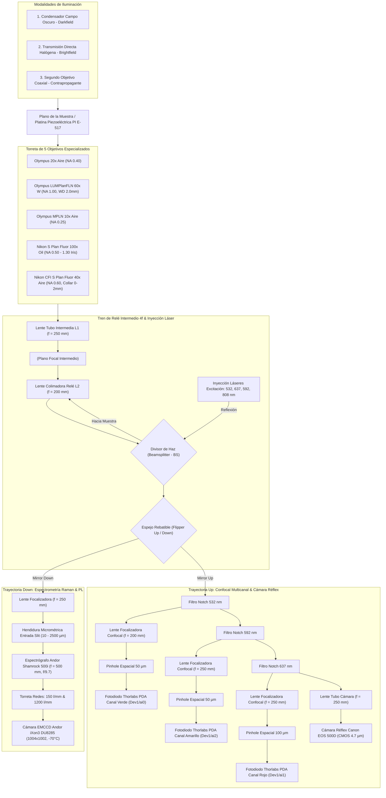

# SYS-305: Arquitectura Optomecánica del Microscopio Derecho y Ruteo Espectral 🔬

**PyPrinting 3.0 / PySpectrum 3.0 — Suite de Nanofabricación, Microscopía Confocal y Espectroscopía Plasmónica**  
**Laboratorio de Nanofotónica — Instituto de Nanosistemas (INS-UNSAM / CONICET)**  
**Autor Principal:** José Luis González Peñafiel (*Becario Doctoral CONICET*)  
**Código del Documento:** `SYS-305` | **Eje Temático:** `[INS]` (Instrumentación Hardware, Optomecánica y Ruteo)  
**Fecha de Emisión:** Septiembre 2026 | **Estado:** Documento Maestro de Referencia Instrumental

---

## 🔗 Matriz de Referencias Cruzadas

- **Fundamentos Científicos Asociados:**
  - `[[CAT-108_Teoria_Optica_Telescopio_Rele_4f_y_Canales_Confocales]]`: Deducción matemática rigurosa del relé $4f$ ($\Gamma = 1.25\times$), difracción Abbe/Rayleigh, fracciones $AU$, Nyquist, acoplamiento $f/\#$, física cuántica iSCAT ($d^3$ vs $d^6$) y perfiles de PSF.
  - `[[CAT-101_Protocolo_Operativo_Impresion_Fototermica_Grillas_2D]]`: Protocolo operativo de impresión y recetas de potencias láser.
  - `[[CAT-103_Control_Lazo_Cerrado_Fototermico_y_Sintesis_Dimeros]]`: Síntesis de dímeros guiada por fotodiodo.
  - `[[CAT-107_Cinetica_Captura_Fotodiodo_Time_Volt_Filtro_Nhold]]`: Dinámica de respuesta de obturadores mecánicos y señales analógicas.
- **Reportes de Sistema Conexos:**
  - `[[SYS-201_Seguridad_Optica_Watchdog_y_Obturadores]]`: Watchdog activo por latido, enclavamientos y control de obturadores en `line0:3`.
  - `[[SYS-202_Actuacion_Flipper_y_Ciclo_Vida_DAQmx]]`: Ciclo de vida DAQmx, pulsos de conmutación del espejo rebatible de potencia.
  - `[[SYS-204_Modulo_Camara_Canon_EDSDK_y_Buffer_RAM]]`: Control nativo de la cámara réflex Canon EOS 500D y Live View.
  - `[[SYS-301_Sistema_Espectrometro_Shamrock500i_iXon3]]`: Espectrógrafo Shamrock 500i, detector iXon3 EMCCD y DLLs C.
  - `[[SYS-302_Calibracion_Espectral_y_Sincronizacion_Flippers]]`: Calibración en orden cero y coordinación reactiva de flippers.
- **Módulos de Código Fuente:** `app.py`, `core/nidaq.py`, `core/shutters.py`, `modules/confocal.py`, `modules/camera.py`, `pyspectrum/drivers/shamrock_driver.py`

---

## 1. 📋 Resumen Ejecutivo y Alcance de la Estación de Microscopía

El presente reporte técnico describe de forma exhaustiva la **arquitectura optomecánica, asignación de líneas DAQmx y ruteo espectral** de la estación de microscopía derecha del Laboratorio de Nanofotónica (INS-UNSAM).

La estación constituye la plataforma experimental sobre la cual operan simultáneamente **PyPrinting 3.0** (impresión óptica de nanopartículas, ensamblado de nanodímeros, escaneo confocal raster y visión en vivo) y **PySpectrum 3.0** (espectroscopía Raman, dispersión LSPR en campo oscuro, fotoluminiscencia y termometría óptica).

El camino óptico comprende:
1. **Torreta multiobjetivo motorizada/manual:** 5 objetivos de alta especialización óptica (inmersión en agua, aceite con iris variable y aire con collar corrector).
2. **Tren de lentes de relé intermedio afocal:** $f_1 = 250\ \text{mm} \to f_2 = 200\ \text{mm}$ ($\Gamma = 1.25\times$), permitiendo la inyección láser colimada en el divisor de haz (*Beamsplitter*, BS).
3. **Conmutador rebatible (*Flipper Mirror*):** Redirige el haz hacia el espectrógrafo Czerny-Turner Shamrock 500i o hacia el bloque de detección confocal y cámara réflex.
4. **Tres canales confocales independientes con filtros Notch:** Verde (532 nm, pinhole $50\ \mu\text{m}$), Amarillo (592 nm, pinhole $50\ \mu\text{m}$) y Rojo (637 nm, pinhole $100\ \mu\text{m}$).
5. **Puerto de visión directa réflex:** Cámara Canon EOS 500D ($f = 250\ \text{mm}$, sensor CMOS APS-C de $15.1\ \text{MP}$).
6. **Tres modalidades de iluminación:** Condensador de campo oscuro (*Darkfield*), transmisión colimada (*Brightfield*) y configuración contrapropagante con segundo objetivo coaxial superior.

---

## 2. 🗺️ Diagrama Esquemático del Banco Óptico y Trazado de Rayos

---

## 3. 🎯 Especificaciones de la Torreta de 5 Objetivos

Cada objetivo del microscopio responde a un régimen físico y experimental concreto:

| Objetivo | Fabricante / Modelo | Focal Nominal $f_{\text{ref}}$ | Distancia Focal $f_{\text{obj}}$ | Apertura Numérica $\text{NA}$ | Medio de Inmersión ($n$) | Distancia de Trabajo ($WD$) | Características Especiales y Mecanismos de Ajuste |
| :--- | :--- | :---: | :---: | :---: | :---: | :---: | :--- |
| **Olympus 20x** | PLN 20x / Achromat | $180\ \text{mm}$ | $9.00\ \text{mm}$ | $0.40$ | Aire ($1.000$) | $1.30\ \text{mm}$ | Inspección intermedia, alineación visual preliminar de celdas. |
| **Olympus 60x W** | LUMPlanFLN 60x W | $180\ \text{mm}$ | $3.00\ \text{mm}$ | $1.00$ | Agua ($1.333$) | $2.00\ \text{mm}$ | **Objetivo maestro de impresión óptica**: inmersión directa en agua sin cubreobjetos, distancia de trabajo larga para celdas fluídicas profundas. |
| **Olympus 10x** | MPLN 10x | $180\ \text{mm}$ | $18.00\ \text{mm}$ | $0.25$ | Aire ($1.000$) | $10.60\ \text{mm}$ | Metalúrgico de campo plano; navegación de macro-áreas y búsqueda inicial de Partícula Ancla $P_0$. |
| **Nikon 100x Oil** | S Plan Fluor ELWD | $200\ \text{mm}$ | $2.00\ \text{mm}$ | $0.50 - 1.30$ | Aceite ($1.515$) | $0.20\ \text{mm}$ | **Diafragma Iris Integrado**: permite reducir la $\text{NA}$ a $< 1.0$ para acoplamiento con condensadores de campo oscuro, o abrirlo a $1.30$ para máxima resolución confocal y Raman. |
| **Nikon 40x Aire** | CFI S Plan Fluor ELWD | $200\ \text{mm}$ | $5.00\ \text{mm}$ | $0.60$ | Aire ($1.000$) | $3.60 - 2.80\ \text{mm}$ | **Collar Corrector de Espesor ($0 - 2.0\ \text{mm}$)**: compensa la aberración esférica introducida por cubreobjetos N° 1 ($0.17\ \text{mm}$) o portaobjetos gruesos ($1.0 - 1.5\ \text{mm}$). |

> [!NOTE]
> Las deducciones analíticas de **aumento lateral efectivo** ($M_{\text{eff}} = 1.25 \times f_{\text{final}} / f_{\text{obj}}$), **resoluciones de Abbe/Rayleigh**, **tamaño de disco de Airy** y **cumplimiento de Nyquist-Shannon** para cada uno de estos 5 objetivos se encuentran detalladas en `[[CAT-108_Teoria_Optica_Telescopio_Rele_4f_y_Canales_Confocales]]`.

---

## 4. 🔬 Tabla Maestra de Configuración Instrumental Óptima por Experimento

La siguiente matriz define la combinación instrumental exacta para los 10 experimentos desarrollados en la plataforma:

| Experimento | Objetivo Recomendado | Modalidad de Iluminación | Tren de Detección Activo | Filtros Ópticos | Pinhole / Slit | Justificación Instrumental y Metrológica |
| :--- | :--- | :--- | :--- | :--- | :---: | :--- |
| **1. Optical Printing 532 nm (Impresión Individual)** | **Olympus 60x W** ($\text{NA}=1.0$, $WD=2.0\text{mm}$) | Transmisión Directa (alineación) + Láser 532 nm colimado en BS | Confocal Verde (PDA `ai0`) + Cámara Canon | Notch 532 nm ($OD > 6$) | Pinhole $50\ \mu\text{m}$ ($0.46\ AU$) | Inmersión en agua libre de aberración en celda de fluido. Pinhole de $50\ \mu\text{m}$ maximiza la caída de señal al fijar la partícula en el sustrato (criterio de parada). |
| **2. Ensamblado de Nanodímeros Plasmónicos** | **Olympus 60x W** | Transmisión Directa + Excitación polarizada 532 nm | Confocal Verde + Confocal Rojo + Cámara | Notch 532 nm + Notch 637 nm | Pinhole $50\ \mu\text{m}$ / $100\ \mu\text{m}$ | Monitoreo simultáneo del scattering plasmónico de la primera partícula y del acoplamiento de campo cercano (*gap mode*) en el canal rojo. |
| **3. Caracterización Analítica de PSF (Gauss / Donut)** | **Olympus 60x W** o **Nikon 100x Oil** ($\text{NA}=1.3$) | Excitación Láser puntual (532 o 637 nm) | Cámara Canon EOS 500D (Live View EDSDK) | Sin notch o Notch atenuado | Sensor Abierto ($45.1\ \text{nm/px}$) | Sobremuestreo de Nyquist ($> 2.9\times$) que permite resolver con precisión sub-píxel la cintura de haz $w_0$ y el nulo de intensidad del vórtice $LG_{01}$. |
| **4. Detección Interferométrica iSCAT** | **Olympus 60x W** | Láser 532 nm en BS con atenuador Flipper Low Power | Confocal Verde (PDA `ai0`) | Notch 532 nm (baja densidad) | Pinhole $50\ \mu\text{m}$ ($0.46\ AU$) | Máxima interferencia homodina entre el reflejo del vidrio y la dispersión elástica; filtrado axial rígido de reflexiones espurias. |
| **5. Espectros LSPR en Campo Oscuro (Darkfield)** | **Nikon 100x Oil** (Iris cerrado a $\text{NA}=0.8$) | **Condensador Campo Oscuro** ($\text{NA}_{\text{cond}} \approx 1.2 - 1.4$) | Flipper Down $\to$ Espectrómetro Shamrock 500i | Sin filtros de corte (paso de banda continuo) | Slit $100 - 200\ \mu\text{m}$ (Red 150 l/mm) | Condición indispensable de campo oscuro: $\text{NA}_{\text{obj}} < \text{NA}_{\text{cond}}$. Permite recolectar únicamente la dispersión pura de resonancia plasmónica sin fondo directo. |
| **6. Espectros de Extinción / Transmisión UV-Vis** | **Olympus 20x** o **Olympus 60x W** | **Transmisión Directa** (Lámpara Halógena) | Flipper Down $\to$ Espectrómetro Shamrock 500i | Filtro dicroico neutro | Slit $50\ \mu\text{m}$ (Red 150 l/mm) | Calibración contra espectro de referencia halógeno (`lamparaIR_grade_2.txt`). Cobertura espectral amplia ($400 - 950\ \text{nm}$). |
| **7. Fotoluminiscencia Plasmónica (PL)** | **Olympus 60x W** | Bombeo Láser 532 nm continuo | Flipper Down $\to$ Espectrómetro Shamrock 500i | Notch 532 nm ($OD > 6$) | Slit $50 - 100\ \mu\text{m}$ (Red 150 l/mm) | Rechazo absoluto de la línea elástica de excitación. Cámara Andor iXon3 a $-70^\circ\text{C}$ con ganancia EM moderada ($G = 50 - 100$). |
| **8. Espectroscopía Raman y SERS Molecular** | **Nikon 100x Oil** ($\text{NA}=1.30$, iris abierto) | Excitación 637 nm o 532 nm (baja potencia) | Flipper Down $\to$ Espectrómetro Shamrock 500i | Notch 637 nm / Notch 532 nm | Slit $25 - 50\ \mu\text{m}$ (Red **1200 l/mm**) | Máxima recolección angular de fotones Raman ($\Omega \propto \text{NA}^2 = 1.69$). Alta resolución espectral ($\Delta \nu \approx 1.5 - 3\ \text{cm}^{-1}$) para resolver bandas analíticas moleculares. |
| **9. Termometría Óptica Anti-Stokes / Stokes** | **Olympus 60x W** | Excitación continua 808 nm o 532 nm | Flipper Down $\to$ Espectrómetro Shamrock 500i | Filtros Notch centrados en la longitud de excitación | Slit $50\ \mu\text{m}$ (Red 1200 l/mm) | Medición simultánea de las ramas Stokes y Anti-Stokes para extracción de temperatura absoluta local: $I_{AS}/I_S = \exp(-\hbar \omega / k_B T)$. |
| **10. Confinamiento Óptico Contrapropagante** | **Olympus 60x W** (inferior) + **Olympus 20x / 40x** (superior) | **Configuración Contrapropagante** (Excitación dual opuesta) | Confocal Verde + Cámara Canon | Filtros Notch en ambos puertos | Pinhole $50\ \mu\text{m}$ | Cancelación de la fuerza neta de presión de radiación ($F_{\text{scat}, 1} = -F_{\text{scat}, 2}$), atrapando partículas coloidales en suspensión antes de su fijación. |

---

## 5. 🔌 Integración de Hardware NI-DAQmx, Canales de Fotodiodos y Obturación

La tarjeta de adquisición **National Instruments NI-DAQmx USB-6341 / PCIe-6323 (`Dev1`)** gobierna las señales analógicas y digitales de la estación:

### 5.1 Entradas Analógicas (Canales Confocales)
- **`Dev1/ai0`**: Fotodiodo amplificado Thorlabs PDA100A-EC (Canal Verde 532 nm / iSCAT). Ganancia típica $20\ \text{dB}$ a $40\ \text{dB}$.
- **`Dev1/ai1`**: Fotodiodo amplificado Thorlabs PDA100A-EC (Canal Rojo 637 nm / Dímeros / PL).
- **`Dev1/ai2`**: Fotodiodo amplificado Thorlabs PDA100A-EC (Canal Amarillo 592 nm / SERS / Fluorescencia).
- **`Dev1/ai3`**: Fotodiodo de referencia de potencia del láser divisor de haz (*Beamsplitter Monitor*).

### 5.2 Salidas Digitales (Obturadores y Flippers)
- **`Dev1/port0/line0`**: Obturador Láser Verde 532 nm (Thorlabs SH05 / Uniblitz).
- **`Dev1/port0/line1`**: Obturador Láser Rojo 637 nm.
- **`Dev1/port0/line2`**: Obturador Láser Infrarrojo 808 nm / Amarillo 592 nm.
- **`Dev1/port0/line3`**: Obturador General de Seguridad / Haz de Transmisión.
- **`Dev1/port0/line4`**: Conmutador de Espejo Rebatible de Potencia (*Power Flipper*: Low Power / High Power).
- **`Dev1/port0/line5`**: Conmutador Flipper de Detección (Espectrómetro Shamrock vs Canales Confocales).

---

## 6. 🌈 Espectrómetro Andor Shamrock 500i y Cámara iXon3

### 6.1 Arquitectura del Espectrógrafo Shamrock 500i
- **Configuración:** Czerny-Turner asimétrica de $500\ \text{mm}$ de distancia focal.
- **Hendidura de Entrada (*Slit*):** Motorizada por micropasos, con apertura continua programable entre **$10\ \mu\text{m}$ y $2500\ \mu\text{m}$** (controlada en software vía `pyspectrum/drivers/shamrock_driver.py`).
- **Torreta de Redes de Difracción (*Triple Grating Turret*):**
  1. **Red 1 (Exploratoria / Amplio Rango):** $150\ \text{líneas/mm}$, *blaze* nominal en el visible.
     - Dispersión recíproca lineal: $\approx 11.2\ \text{nm/mm}$.
     - Cobertura espectral simultánea sobre el sensor iXon3 ($13.3\ \text{mm}$ de ancho): $\Delta \lambda \approx 150\ \text{nm}$ por ventana fija.
     - Aplicación: Espectros de extinción LSPR, fotoluminiscencia y cinéticas rápidas de crecimiento.
  2. **Red 2 (Alta Resolución / Raman & SERS):** $1200\ \text{líneas/mm}$, *blaze* en $500\ \text{nm}$.
     - Dispersión recíproca lineal: $\approx 1.4\ \text{nm/mm}$.
     - Cobertura espectral simultánea: $\Delta \lambda \approx 18.6\ \text{nm}$ ($\approx 450 - 550\ \text{cm}^{-1}$ en Raman Shift a 532 nm).
     - Resolución espectral instrumental con slit de $20\ \mu\text{m}$: $\delta \lambda \approx 0.05\ \text{nm}$ ($\approx 1.8\ \text{cm}^{-1}$), permitiendo resolver desdoblamientos vibracionales finos.
  3. **Modo Step & Glue:** Cosido espectral automatizado en `pyspectrum` que rota el ángulo de la red mediante motor paso a paso, adquiere ventanas superpuestas y realiza la interpolación spline continua con normalización de sensibilidad detector-red.

### 6.2 Cámara EMCCD Andor iXon3 (DU8285_VP / TC285)
- **Sensor:** Transferencia de cuadro con multiplicación electrónica de electrones (EMCCD, Texas Instruments TC285).
- **Matriz activa:** $1004\ (\text{H, dispersión}) \times 1002\ (\text{V, ranura})\ \text{píxeles}$, tamaño de píxel de $13.0 \times 13.0\ \mu\text{m}$.
- **Enfriamiento Termoeléctrico Peltier:**
  - Rango operativo: $+20^\circ\text{C}$ a **$-70^\circ\text{C}$** (enfriamiento por aire) o **$-85^\circ\text{C}$** (con recirculador de agua).
  - Corriente oscura (*dark current*): $\approx 0.001\ e^-/\text{píxel}/\text{s}$ a $-70^\circ\text{C}$.
  - Ruido de lectura convencional: $6\ e^-$ a $1\ \text{MHz}$.
  - Con ganancia EM activa ($G_{\text{EM}} \ge 100$), el ruido de lectura efectivo decae a $< 1\ e^-$, permitiendo detección en régimen de conteo de fotón único para espectroscopía de molécula individual (SM-SERS).

---

## 7. 🛠️ Protocolos de Calibración y Buenas Prácticas de Laboratorio

1. **Alineación de Cono Numérico para Campo Oscuro:**
   - Al emplear el condensador de campo oscuro, **verificar que el iris del objetivo Nikon 100x Oil se encuentre cerrado a $\text{NA} \le 0.8$**. Si el iris permanece abierto a $\text{NA} = 1.30$, el haz directo del condensador penetrará en el cono de recolección, arruinando el fondo oscuro y saturando el EMCCD.
2. **Corrección de Espesor de Cubreobjetos (Nikon 40x):**
   - Medir con micrómetro el espesor del cubreobjetos utilizado ($t \approx 0.17\ \text{mm}$ para N° 1 o $t \approx 0.13\ \text{mm}$ para N° 0). Girar el collar corrector del Nikon 40x hasta la graduación correspondiente. Un desajuste de solo $0.05\ \text{mm}$ en $\text{NA} = 0.60$ degrada la intensidad máxima del foco en más de un $40\%$ debido a aberración esférica primaria ($W_{040}$).
3. **Calibración de Longitud de Onda del Espectrómetro:**
   - Antes de iniciar mediciones Raman de precisión, adquirir el espectro de emisión de una lámpara de calibración espectral de Neón/Argón o el pico de fonón óptico de una oblea de Silicio monocristalino (pico estándar a $\Delta \nu = 520.50\ \text{cm}^{-1}$). Ingresar el offset de calibración en `pyspectrum` (ver `[[SYS-303_Protocolo_Metrologico_Calibracion_Espectrometro]]`).
4. **Protección Térmica de la Cámara Andor:**
   - Monitorear en el panel de PySpectrum que el indicador térmico alcance el estado bloqueado (`Locked` a $-70^\circ\text{C}$) antes de adquirir espectros de integración larga ($t_{\text{int}} > 5\ \text{s}$). Al apagar el sistema, elevar la consigna a $0^\circ\text{C}$ antes de desconectar la refrigeración para evitar condensación interna en la ventana óptica.
5. **Alineación de Pinholes en Canales Confocales:**
   - Utilizar el modo `Sin límite (Modo Alineación)` del Watchdog de shutters en `core/shutters.py`. Colocar una muestra de nanopartículas de oro de 60 nm fijadas, centrar una partícula en el confocal y ajustar los tornillos micrométricos $X-Y$ de la montura del pinhole correspondiente (Thorlabs) hasta maximizar la tensión en el fotodiodo PDA en el osciloscopio de la traza (`F1`).
