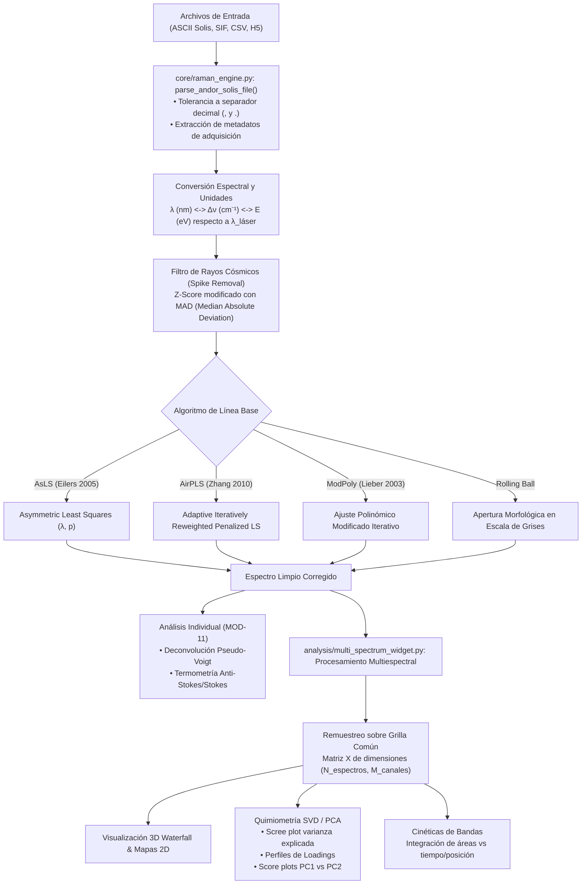

# SYS-306: Arquitectura del Motor Raman y Quimiometría Multiespectral 📊

**PyPrinting 3.0 / PySpectrum 3.0 — Suite de Nanofotónica y Control Instrumental**  
**Laboratorio de Nanofotónica — Instituto de Nanosistemas (INS-UNSAM / CONICET)**  
**Autor Principal:** José Luis González Peñafiel (*Becario Doctoral CONICET*)  
**Código del Documento:** `SYS-306` | **Eje Temático:** `[DAT] (Quimiometría, Procesamiento de Señales Espectrales y Análisis Multiespectral)`  
**Fecha de Emisión:** Septiembre 2026 | **Estado:** Aprobado / Producción  
**Módulos de Código Fuente:** `core/raman_engine.py`, `analysis/multi_spectrum_widget.py`, `raman_analyzer.py`

---

## 🔗 Matriz de Referencias Cruzadas

* **Reportes de Sistema Conexos:**
  * `[[SYS-301_Sistema_Espectrometro_Shamrock500i_iXon3]]`
  * `[[SYS-302_Calibracion_Espectral_y_Sincronizacion_Flippers]]`
  * `[[SYS-304_Arquitectura_Analizador_SIF_y_Filtros_Cascada]]`
  * `[[SYS-104_Matriz_Intercambio_Archivos_y_Formatos_IO]]`
* **Fundamentos Científicos Asociados:**
  * `[[CAT-108_Teoria_Optica_Telescopio_Rele_4f_y_Canales_Confocales]]`
  * `[[CAT-109_Electrodinamica_Fuerzas_Opticas_y_Termoplasmonica_Printing]]`
  * `[[CAT-401_Estandar_Serializacion_Jerarquica_Contenedor_HDF5]]`
* **Manuales de Usuario de Módulos:**
  * `[[MOD-06_PySpectrum_Espectroscopia_Shamrock]]`
  * `[[MOD-11_Raman_Analyzer_Suite_Quimiometria]]`

---

## 1. Resumen Ejecutivo

El subsistema de espectroscopía Raman y análisis quimiométrico de PyPrinting 3.0 está sustentado por dos componentes computacionales desacoplados de alto rendimiento:
1. **`core/raman_engine.py`**: Motor algorítmico puro (sin dependencias gráficas) que concentra las operaciones numéricas de conversión espectral, remoción de rayos cósmicos por mediana absoluta, cinco algoritmos avanzados de corrección de línea base (AsLS, AirPLS, ModPoly, Rolling Ball, Splines), ajuste no lineal de perfiles de banda y nanotermometría Anti-Stokes/Stokes.
2. **`analysis/multi_spectrum_widget.py`**: Suite gráfica interactiva de visualización multiespectral y quimiometría multivariable, capaz de procesar series temporales y mapeos hiperespectrales de cientos de espectros mediante representaciones en cascada 3D (*waterfall*), mapas de calor bidimensionales, descomposición en componentes principales (**PCA por SVD**) y perfiles cinéticos de fotodesorción/catálisis plasmónica en tiempo real.

Este reporte formaliza la arquitectura matemática de los algoritmos de filtrado, el contrato de datos matricial para espectros interpolados y los estándares de descomposición espectral implementados.

---

## 2. Diagrama de Flujo del Pipeline Quimiométrico

---

## 3. Algoritmos Fundacionales de `core/raman_engine.py`

### 3.1 Conversión Espectral y Calibración Física

La conversión entre longitud de onda de emisión dispersada $\lambda$ ($\text{nm}$) y el corrimiento Raman $\Delta\tilde{\nu}$ ($\text{cm}^{-1}$) respecto a la línea del láser incidente $\lambda_0$ está regida por:

$$\Delta\tilde{\nu} = \left( \frac{1}{\lambda_0} - \frac{1}{\lambda} \right) \times 10^7 \quad [\text{cm}^{-1}]$$

La energía relativa en electrón-voltios ($eV$) se vincula mediante:
$$E = \Delta\tilde{\nu} \times 1.23984193 \times 10^{-4} \quad [\text{eV}]$$

---

### 3.2 Detección y Remoción de Rayos Cósmicos por MAD

Los detectores CCD científicos refrigerados (Andor iXon3) presentan eventos estocásticos de impacto por rayos cósmicos que generan espigas (*spikes*) hiper-estrechas (1 a 2 píxeles de ancho) de altísima amplitud. El motor implementa el método del **Z-score modificado basado en la Desviación Absoluta Mediana (MAD)**:

1. Se computa la mediana móvil de ventana corta ($w = 5$ píxeles): $y_{\text{med}} = \text{medfilt}(y, w)$.
2. Se evalúa el vector residual: $d = y - y_{\text{med}}$.
3. Se calcula el estimador robusto de dispersión:
   $$\text{MAD} = \text{median}(|d - \text{median}(d)|)$$
4. Se calcula el Z-score modificado:
   $$M_i = \frac{0.6745 \times (d_i - \text{median}(d))}{\text{MAD}}$$
5. Una muestra es clasificada como rayo cósmico si satisface la condición asimétrica positiva:
   $$\text{Spike}_i = (M_i > \text{threshold}) \land (d_i > 0) \quad (\text{predeterminado } \text{threshold} = 6.0)$$
   Los píxeles clasificados como espigas se sustituyen limpiamente por la mediana local $y_{\text{med}}$, preservando intacto el ancho y área de los picos Raman físicos reales.

---

### 3.3 Algoritmos Avanzados de Corrección de Línea Base

#### 1. Asymmetric Least Squares (AsLS) — Eilers & Boelens (2005):
Minimiza la función de costo penalizada:
$$S = \sum_{i=1}^L w_i (y_i - z_i)^2 + \lambda \sum_{i=1}^{L-2} (\Delta^2 z_i)^2$$
donde $\Delta^2$ es el operador discreto de segunda diferencia matricial ($D$). En forma matricial:
$$(W + \lambda D^T D) z = W y$$
Los pesos se reasignan en cada iteración de manera asimétrica para favorecer los puntos basales:
$$w_i = \begin{cases} p & \text{si } y_i > z_i \quad (\text{pico Raman}) \\ 1 - p & \text{si } y_i \le z_i \quad (\text{línea base}) \end{cases}$$
con $\lambda \sim 10^4 - 10^7$ (rigidez) y $p \sim 10^{-3}$ (asimetría). Se resuelve mediante matrices dispersas CSC (`scipy.sparse.csc_matrix`) con `spsolve`.

#### 2. Adaptive Iteratively Reweighted Penalized Least Squares (AirPLS) — Zhang et al. (2010):
A diferencia de AsLS, no requiere sintonía manual del parámetro de asimetría $p$. En cada iteración $t$, los pesos de los puntos por encima de la línea base tentativa se anulan ($w_i = 0$), mientras que los puntos por debajo se ponderan exponencialmente según la magnitud de su desviación negativa:
$$w_i^{(t)} = \begin{cases} 0 & \text{si } y_i \ge z_i^{(t)} \\ \exp\left( \frac{t |y_i - z_i^{(t)}|}{|\mathbf{d}_{\text{neg}}|_1} \right) & \text{si } y_i < z_i^{(t)} \end{cases}$$
garantizando una línea base que jamás erosione picos estrechos ni mesetas anchas.

---

## 4. Arquitectura Multiespectral y Quimiometría (`analysis/multi_spectrum_widget.py`)

### 4.1 Remuestreo sobre Grilla Común
Al analizar lotes de espectros adquiridos en diferentes ventanas de Step & Glue o con derivas térmicas del espectrógrafo, cada espectro posee su propio vector de longitudes de onda $\mathbf{x}_k$. El widget construye un eje espectral unificado $\mathbf{x}_{\text{grid}}$ que abarca la intersección o unión del rango $[x_{\text{min}}, x_{\text{max}}]$ y remuestrea todos los espectros mediante interpolación lineal o cúbica:
$$\mathbf{X} \in \mathbb{R}^{N \times M}$$
donde $N$ es el número de espectros en la serie temporal/espacial y $M$ es el número de canales espectrales unificados.

---

### 4.2 Descomposición en Componentes Principales (SVD PCA)

El análisis quimiométrico de variaciones espectrales sutiles (cambios de conformación molecular, adsorción de analitos SERS, degradación) se realiza mediante **Descomposición en Valores Singulares (SVD)** sobre la matriz centrada en la media:

$$\mathbf{X}_{\text{centrada}} = \mathbf{X} - \mathbf{1} \boldsymbol{\mu}^T$$
$$\mathbf{X}_{\text{centrada}} = \mathbf{U} \mathbf{\Sigma} \mathbf{V}^T$$

1. **Scree Plot de Varianza Explicada**:
   La varianza asociada al componente $k$-ésimo es $\lambda_k = \frac{\sigma_k^2}{N-1}$. La fracción explicada individual y acumulada guía al usuario para retener típicamente entre 2 y 4 componentes principales.
2. **Perfiles de Loadings ($\mathbf{V}$)**:
   Cada columna de $\mathbf{V}$ representa un espectro de carga que identifica unívocamente qué bandas vibracionales covarían positivamente o negativamente a lo largo del experimento.
3. **Puntuaciones (Scores, $\mathbf{T} = \mathbf{U} \mathbf{\Sigma}$)**:
   Mapea la trayectoria del sistema en el espacio reducido de componentes (e.g. PC1 vs PC2), revelando transiciones de fase, cinéticas químicas o agrupamientos coloidales (*clusters*).

---

### 4.3 Integración de Cinéticas y Visualización 3D

* **Modo Cascada 3D (*Waterfall*)**: Renderizado con `pyqtgraph.PlotWidget` o perfiles de elevación 3D para evaluar la evolución espectro-temporal sin solapamiento visual.
* **Mapas 2D (*Heatmaps*)**: Matriz de colores falso-color $(t, \Delta\tilde{\nu})$ con paletas ergonómicas (`viridis`, `inferno`, `magma`).
* **Seguimiento Cinético de Bandas**: Integración de área bajo la curva en una ROI espectral $[\nu_1, \nu_2]$:
  $$A(t) = \int_{\nu_1}^{\nu_2} (I(\nu, t) - I_{\text{base}}(\nu, t)) d\nu$$
  permitiendo graficar la constante de velocidad fototérmica $k_{\text{reac}}$ directamente en la interfaz.
