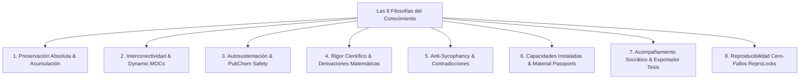

# 👤 Perfil Maestro Enriquecido del Investigador: José Luis González Peñafiel

> **Documento de Contexto Maestro y Memoria Viva del Usuario.** Este archivo integra la biografía académica, los proyectos de investigación, la instrumentación de laboratorio, el stack computacional, el estilo de trabajo científico, las capacidades instaladas y las **8 Filosofías Fundamentales del Conocimiento** de José Luis. Servirá como guía continua para personalizar la asistencia del agente AI Antigravity.

---

## 🏛️ 1. Identidad Académica & Trayectoria

- **Nombre Completo:** José Luis González Peñafiel.
- **Edad:** 27 años.
- **Origen:** Quito, Ecuador.
- **Formación de Grado:** Físico graduado por la **Escuela Politécnica Nacional (EPN)**, Quito, Ecuador.
- **Filiación & Doctorado Actual:** Candidato a Doctor en Física en la **Universidad Nacional de San Martín (UNSAM)**, Buenos Aires, Argentina / Miembro del **Instituto de Nanosistemas (INS - UNSAM)** / Residente en CABA.
- **Proyección & Postgrado:** Trayectoria de posgrado en **Sorbonne University** (Francia) con orientación avanzada en fotónica.
- **Laboratorios & Proyectos Previos:**
  - Integrante del *Mass Spectroscopy and Spectrometry Group (MSOS)* del Laboratorio de Espectroscopía (2023–2025).
  - Integrante del *Laboratorio de Interacción Radiación-Materia* (implementación de cámara de irradiación electrónica para modificación de materiales dieléctricos y 2D).
  - Interno (2021) y Asistente de Investigación (2022) en el Proyecto EPN **PIGR 19-13: "Interacción de electrones rápidos con materiales dieléctricos y bidimensionales"** (Director: Dr. Esteban Irribarra).
  - Participación en el proyecto de *Laboratorio Fotovoltaico Remoto/Educativo* (sistemas mono/doble eje, autolimpieza y filtros) en colaboración con DACI-FIIE, Scynergy-FIM y SmartLab-FIS.
- **Afiliaciones, Premios & Divulgación:**
  - Ganador / Participante del *Optica Foundation Chapter Community Engagement Prize 2023*.
  - Miembro activo del *Optica Student Chapter EPN* e *IEEE Photonics Society*.
  - Participante en escuelas científicas internacionales: DESY Summer Program, XV Escuela NanoAndes 2026, II Escuela Nanomer.

---

## 🔬 2. Perfil Científico, Plasmónica & Proyectos Clave

### A. Proyecto 1: Redes Plasmónicas & Resiliencia Colectiva
- **Título de Investigación:** *"Plasmonic lattices of colloidal Au nanospheres"*.
- **Fenomenología Físico-Química:**
  - Resiliencia de modos colectivos frente a vacantes en la red, desorden posicional, modificación de periodicidad ($a$) y acoplamiento de modos oscuros y multipolares.
  - Magnetoplasmónica, efectos magneto-ópticos (Kerr y Faraday), nanocavidades y fenómenos ultrarrápidos.
- **Metodología Computacional & Análisis Fourier:**
  - Simulaciones Monte Carlo de desorden estructural (redes cuadradas $N=30$, $a=400\text{ nm}$ o $a=100$, límite físico duro $a/3$, resolución 50 nm/px, PSF gaussiana $\sigma=120\text{ nm}$).
  - Análisis en espacio recíproco mediante 2D FFT, espectros de potencia logarítmicos, perfiles axiales ($x=0, y=0$), ajuste gaussiano no lineal (`curve_fit`), comparación entre intensidad de pico experimental $H$ y amplitud ajustada $A$, normalización del desplazamiento de Fourier $(\Delta k / k)$ y formalismo de **Debye-Waller**.

### B. Proyecto 2: Dispositivo DLS (Dynamic Light Scattering) Open-Source (ISO 22412 / NIST)
- **Propósito:** Desarrollo de un sistema de dispersión dinámica de luz de bajo costo y código abierto para la caracterización del diámetro hidrodinámico y polidispersidad de coloides.
- **Especificaciones de Hardware:**
  - Láseres de 650 nm, 532 nm y 405 nm (~5 mW).
  - Fotodetectores: Silicon Photomultiplier (SiPM) *MicroFC-SMTPA-60035*, fotomultiplicador *Hamamatsu R1463*, detector *Thorlabs PMM01*, fotodiodo *BPW34*.
  - Electrónica de Adquisición: Osciloscopio *Keysight DSO-X 2002A* (75 GSa/s, 50k buffer), amplificadores operacionales de ultra-bajo ruido *OPA627BP* y *LM741N*.
- **Pipeline de Análisis en Python:**
  - Corrección de baseline $\longrightarrow$ Autocorrelación temporal $\longrightarrow$ Ajuste monoexponencial/cumulante $\longrightarrow$ Factor $\beta$ $\longrightarrow$ Estimación del tamaño hidrodinámico por Stokes-Einstein.

### C. Proyecto 3: Sistema de Control de Microscopía Personalizado (PyQt6 / NI-DAQ)
- **Desarrollo:** Sistema modular de control instrumental e integración en Python con GUI en PyQt6 y Dear PyGui.
- **Módulos Integrados:** Tarjeta NI-DAQ, platina piezoeléctrica XYZ con control nanométrico, cámara *Canon EOS 500D*, visualización y procesamiento de imágenes en tiempo real.

### D. Proyecto 4: Atrapamiento Óptico, Fuerzas Fototérmicas & Estabilidad Coloidal
- **Modelado de Fuerzas Ópticas:** Atrapamiento óptico de nanopartículas de oro (AuNPs de 80–100 nm) excitadas a 532 nm con potencias de 0.8–1 mW y objetivo de inmersión de alta apertura numérica (`pyfocus`).
- **Química de Superficies & DLVO:**
  - Estabilidad coloidal en soluciones Milli-Q con 0.75 mM NaCl.
  - Medición y modelado de potencial Zeta ($\zeta \approx -35\text{ mV}$), constantes de Hamaker y potenciales de interacción interpartícula.
  - Funcionalización de sustratos de vidrio con polielectrolitos **PDDA/PSS**.
  - Síntesis y caracterización de coloides metálicos (Au, Ag), bimetálicos (AuPd core-shell/aleación), semiconductores (TiO2) y películas mesoporosas de zirconia-ceria.

---

## 💻 3. Stack Computacional & Análisis Científico

- **Lenguaje Central:** Python para simulaciones Monte Carlo, procesamiento de señales/imágenes y control instrumental.
- **Librerías Científicas:** NumPy, SciPy, Matplotlib, Pandas, OpenCV, `tifffile`, `trackpy`, `picasso`, `pyfocus`, `statsmodels`.
- **Pipelines de Análisis de Imágenes & Partículas:**
  - Localización de nanopartículas con precisión sub-píxel, ajustes gaussianos 2D.
  - Deconvolución por algoritmo de **Richardson-Lucy**.
  - Distribuciones estadísticas de Rice y Rayleigh para amplitudes de Fourier, análisis de momentos y alineamiento de Procrustes.
- **Diseño CAD & Fabricación Digital:** Autodesk Fusion 360, impresión 3D FDM con **Prusa Mini**, integración con Raspberry Pi y electrónica analógica/digital.

---

## 🏛️ 4. Las 8 Filosofías Fundamentales del Conocimiento

1. 🛡️ **Preservación Absoluta & Acumulación (Directiva Máxima del Usuario)**:
   - **Regla de Oro Inviolable:** *JAMÁS borrar o eliminar código, ecuaciones, notas o contenido previamente desarrollado al reorganizar documentos; integrar, acumular y expandir manteniendo siempre la información original, a menos que el usuario indique explícitamente una reestructuración profunda.*
   - Repositorio completo en Markdown (`06_Repository/Papers/`, `Theses/`, `Books/`), congelación de entornos (`Repro_Locks/`) y Pasaportes de Nanomateriales (`Material_Passports/`).
2. 🕸️ **Interconectividad & Dynamic MOCs**:
   - Enlaces bidireccionales `[[wikilinks]]`, Mapas de Contenido Dinámicos (`MOCs/`), matrices de trazabilidad $\text{Ecuación} \longleftrightarrow \text{Línea de Código}$ y derivaciones paso a paso (`Derivaciones/`).
3. 🔄 **Autosustentación & PubChem Safety**:
   - Ingesta automática con metadatos oficiales vía APIs (Crossref DOI, OpenLibrary ISBN, PubChem, OpenAlex), matrices de compatibilidad química y búsqueda semántica híbrida BM25/TF-IDF.
4. 🔬 **Rigor Científico & Derivaciones Matemáticas**:
   - Deducciones matemáticas paso a paso desde los primeros principios (`Derivaciones/`), auditoría L3 (`claim-audit`) y guardrails de estabilidad CFL ($\Delta t$) y flujo de Poynting.
5. ⚖️ **Validación por Pares, Anti-Sycophancy & Contradicciones**:
   - Panel de 4 personas expertas (**Físico Teórico**, **Físico Computacional**, **Físico Experimental**, **Químico de Superficies**) con protocolo de concesión 1-5 (Devil's Advocate exigiendo evidencia empírica $\ge 4$) y seguimiento de contradicciones en la literatura (`Contradicciones_y_Cambios_de_Paradigma.md`).
6. 🚀 **Capacidades Instaladas, Pasaportes de Materiales & Bitácoras de Hardware**:
   - Fichas maestras de infraestructura en `05_Installed_Capabilities/`, Pasaportes de Muestras (`Material_Passports/`), Bitácoras de Calibración (`Equipment_Logs/`) y análisis de adaptabilidad `lab-gap-bridge`.
7. 🎓 **Acompañamiento Socrático, Docencia Integrada & Exportador de Tesis**:
   - Mentoría socrática (`socrates`), Hojas Técnicas paso a paso (`process-sheet`), laboratorios STEM ejecutables (`lab-forge`) y exportador de esquemas de tesis (`export-thesis-outline`).
8. 🔒 **Reproducibilidad Cero-Fallos & Congelación de Entornos (`Repro_Locks/`)**:
   - Registros inmutables con semillas aleatorias de Monte Carlo, versiones de paquetes y archivos `.yaml` para reproducción exacta.

---

## 🏋️ 5. Bienestar, Entrenamiento & Nutrición (Datos Dinámicos)

- **Estatura:** 1.77 m.
- **Peso:** 99 kg (Dato variable, actualizado de registros anteriores).
- **Entrenamiento:** Fuerza/pesas 6 días/semana (División **Push / Pull / Legs**), fútbol complementario en días de descanso.
- **Nutrición:** Plan de 5 comidas diarias (pollo/carne como fuentes de proteína), suplementación con creatina y whey protein, organización semanal de cocina adaptada a precios de Argentina.

---

## 📝 6. Historial de Directivas & Ajustes del Usuario

- **D1:** Clasificación híbrida de papers por proporción y parámetros multidisciplinarios.
- **D2:** Comparación de hallazgos de papers nuevos con la matriz de agujeros de literatura previa.
- **D3:** Incorporación del rol de Químico de Superficies al Panel de Debate de 4 Personas.
- **D4:** Resúmenes científicos profundos y notas atómicas con ecuaciones LaTeX y diagramas Mermaid.
- **D5:** Ingesta masiva y estructura del repositorio inmutable `06_Repository/`.
- **D6:** Clasificación por subtipos (Research, Review, Methods, Perspective, Letter), tesis y libros por ISBN.
- **D7:** Enriquecimiento autónomo web y seguimiento de debates/cambios de paradigma.
- **D8:** Integración de frameworks `academic-research-skills` (L3 audit, anti-sycophancy) y `teaching-skills` (mentoría socrática, lab forge).
- **D9 (Directiva Máxima):** Regla de Oro Inviolable de Preservación Absoluta.
- **D10:** Incorporación del Módulo 5 (Capa de Capacidades Instaladas `05_Installed_Capabilities/` & comando `lab-gap-bridge`).
- **D11:** Protocolo de Extracción Profunda para Documentos/Proyectos Propios (`--own`).
- **D12:** Manifiesto y Constitución de la Bóveda ([`descripcion.md`](file:///C:/Users/josel/Documents/Obsidian_Vault/Nanofotonica/descripcion.md)).
- **D13:** Incorporación de las 9 Sugerencias Avanzadas (MOCs, Pasaportes de Nanomateriales, Bitácoras de Hardware, ReproLocks, Derivaciones Matemáticas, Informes de Síntesis, Contradicciones, Exportador de Tesis y PubChem Chemical Safety).
